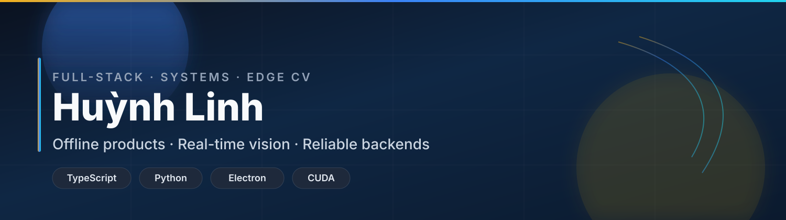

<!--
  GitHub profile: https://github.com/while-linhhq
  Special repo: while-linhhq/while-linhhq
-->

  <!-- Banner (static SVG in-repo — always works offline in markdown) -->
  

  <!-- Typing animation (third-party SVG service; falls back as image) -->
   
  

  

    
    
    
  

  

---

### About

I'm **Huỳnh Linh** — I design and ship **end-to-end systems**: desktop offline apps, APIs, and GPU-backed computer vision that has to work when the network doesn't.

Currently deep in **coach / sports tech**, **edge analytics (RTSP · YOLO · tracking)**, and **local-first product craft**.

---

### Toolbox

  <!-- Skill icons — compact icon strip used widely on pro profiles -->
  

 

| Layer | Tools I use daily |
| --- | --- |
| **Client** | React · Vite · Tailwind · Electron · TanStack Query |
| **Server** | Node.js · FastAPI · Drizzle / SQLAlchemy · Postgres · Redis · SQLite |
| **AI / Edge** | PyTorch · YOLO · CUDA · MediaMTX / WebRTC |
| **Ship** | Docker · pnpm · GitHub Actions · Linux VPS |

---

### Featured systems

<table>
  <tr>
    <td width="50%" valign="top">

#### Gun LMS
Offline coaching LMS for field use — athletes, sessions, ammo inventory, plan boards, in-app PDF/DOCX/XLSX viewers.  
**Stack:** Electron · React · TypeScript · SQLite

</td>
    <td width="50%" valign="top">

#### People counting / edge CV
Multi-RTSP cameras, tracking + line-crossing, live dashboard & WebRTC preview, snapshot retention.  
**Stack:** FastAPI · YOLO · GPU · React · Redis

</td>
  </tr>
  <tr>
    <td width="50%" valign="top">

#### OCR / dock services
Admin UI + GPU OCR pipelines, Dockerized Postgres-backed services.  
**Stack:** FastAPI · PaddleOCR / torch · Docker

</td>
    <td width="50%" valign="top">

#### Public samples
- [transpot-sv-webapp](https://github.com/while-linhhq/transpot-sv-webapp) · TypeScript  
- [EcoTokenSystem-L](https://github.com/while-linhhq/EcoTokenSystem-L) · JavaScript  

</td>
  </tr>
</table>

---

### Metrics

  
  

 

  

 

  <!-- Activity graph (contribution snake-style line chart) -->
  

---

### Principles

- **Ship the thin vertical slice** — schema → API → UI → real verify  
- **Local-first when the field has no internet**  
- **Prefer boring tech that survives production** over clever demos  

---

### Contact

  
  

  Open to collaboration on **offline desktop products**, **CV / edge analytics**, and **full-stack systems** under real constraints.

  

    Profile assets live in this repo · widgets use public SVG services (stats / typing / skillicons / activity graph)
  

